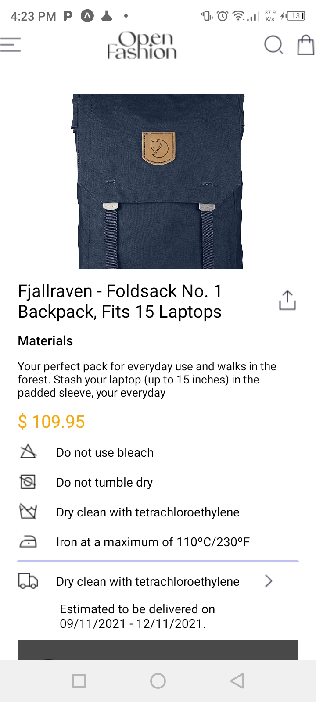
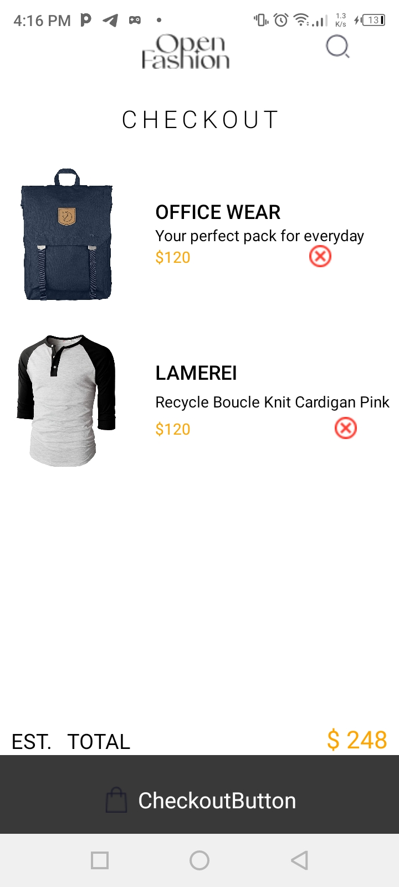
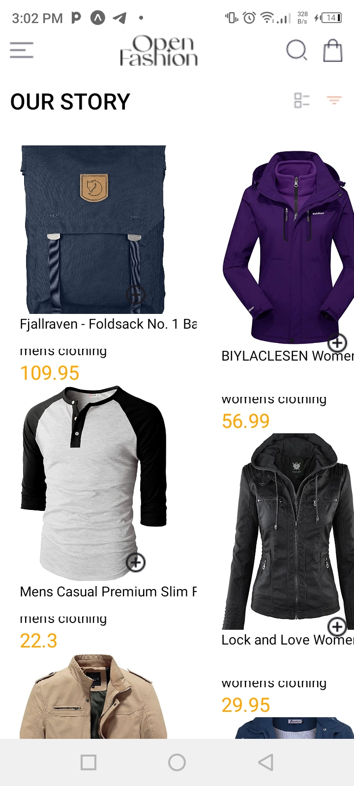

# rrn-assignment6-11041617
# Obed Sarkodie

# Project Discription

This Expo application provides a convenient e-commerce platform that allows users to view 
product listings, check out detailed product information, add items to their shopping cart,
 handle cart contents, and utilize local storage for data persistence.

 # Key Features

    1. Users have the ability to explore a range of products obtained from an external API.
    2. Detailed information about each product is available on a dedicated screen.
    3. Users can add products to their cart and conveniently remove items they do not want.
    4. User selections and cart contents are stored locally .
    5. Seamless accessibility is provided through a smooth drawer component.
   

# Components

    1. HomeScreen: Displays a list of products fetched from an external API.
    2. ProductDetailScreen: Presents detailed information about a selected product.
    3. CartScreen: Shows the items currently in the user's cart.
    4. DrawerComponent/NavigationMenu (Optional): Provides swipe or button-triggered menu access
     (leverage Expo navigation if preferred).
    5. AddToCartButton: Enables users to add products to their cart.
    6. RemoveFromCartButton: Allows users to remove items from their cart.    

# Screenshots

